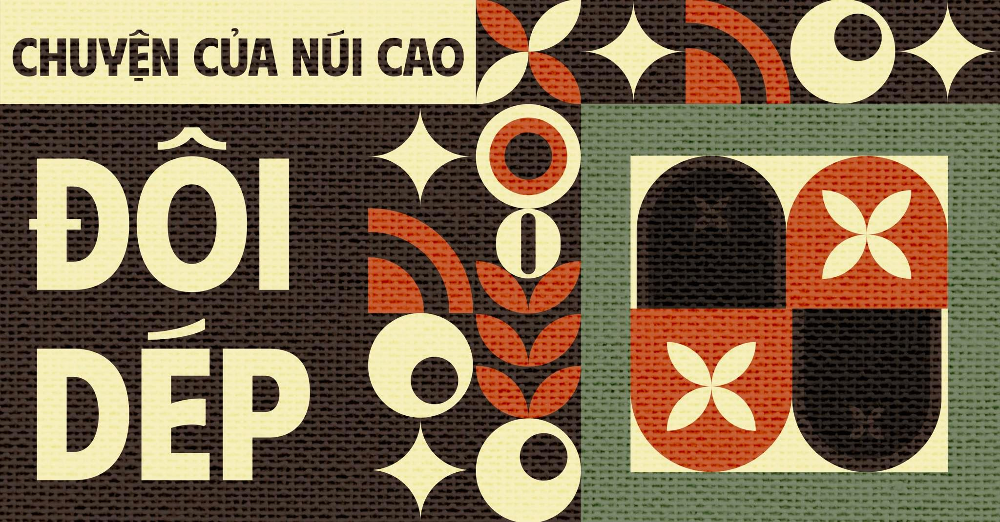

“Sao bé con lại đi chân đất?”

“Em thích đi thế này, thoải mái hơn. Đi dép vào em chẳng thấy quen gì cả.”

Trên sân, bóng mặt trời đổ xuống, toả ra cái ánh nắng gay gắt giữa ban trưa. Thế mà mấy đứa nhỏ dân tộc vẫn đang khoái chí chạy giỡn, cười đùa trên những đôi chân trần. Cứ tưởng rằng các em không có dép để đi. Hoá ra khi đến hỏi thăm thì mới biết, các em có dép, nhưng lại chẳng mấy khi dùng.

Mọi người khi ghé thăm nơi đây vẫn thường đánh giá Tây Nguyên nghèo vì họ thấy trẻ em không đi dép. Cứ bụi bụi, trần trụi như thế. Nhưng thật ra, đó cũng là sở thích của trẻ con nơi đây, các em không ưng đi giày vì thấy thoải mái hơn và phần nhiều là vì không quen. Có lẽ, cuộc sống mộc mạc và gắn liền cùng môi trường, cùng cái đất đỏ vùng cao đã trở nên thân thuộc với các em. Và cũng có lẽ, cái thiếu thốn, nghèo khó lâu dần đã hòa làm một với cuộc sống thường ngày của trẻ nhỏ nơi đây. Phải chăng, việc “không đi dép” ngày qua ngày cũng đã hoá thành thứ cảm xúc gì đó khiến các em… thích đi chân đất hơn?

Trên mọi nẻo đường, từ trẻ nhỏ cho đến người lớn, ta bắt gặp rất nhiều đôi chân trần cứ thế “rảo bước” để đến nơi cần đến. Đám trẻ ban nãy vui đùa ngoài sân giờ đã chạy về nhà phụ nấu bữa cơm chiều. Giữa khoảng không núi rừng Tây Nguyên khi mặt trời buông xuống, ta lại nghe vang vọng lời hát:

“Ôi, thời gian  
Hãy quên đi Đôi chân cồng kềnh  
Cha đi giữa rừng hoang vu  
Lưng cha đội nắng gầy  
Ôi tóc bạc tựa trăng soi  
Cả một đời và cả cuộc đời  
Đôi chân trần…”  
(Đôi chân trần - Y Phôn Ksor)
